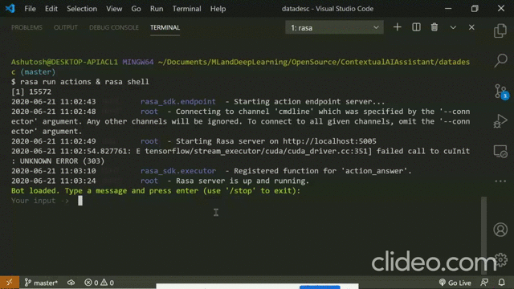

# Machine Learning Data Bot

            

This project is the small demo to create Conversation Agent which can perform tasks on data and also can give you important insights from data.
The bot is created using opensource NLP & NLU framework `Rasa` which gives ample foundation to create Knowledge based chatbot by intents, entities, slots etc.

You can see the demo from below GIF where I am asking the bot questions regarding different datasets and it is answering me and also it is doing changes in datasets as per my messages.

# How to Run the Project
- Install latest version of `rasa` using the instructions given on [official website](https://rasa.com/docs/rasa/user-guide/installation/) and `Python` version in your system must be `3.6 or greater`.
- Clone this repository with following command.
  - `git clone https://github.com/ashutosh1919/ml-data-bot.git`
- I have not uploaded the pretrained model file because of its size but you can train model using following command.
  - `rasa train`
  - Note that, you **don't need GPU** to train model.
  - Also, the model will take 1-2 minutes time only to train on ordinary machine.
- Now, the model is trained and you can talk to model.
- I highly recommend using `Visual Studio Code` to run the project.
- Run following command in `bash` terminal.
  - `rasa run actions & rasa shell`
  - `rasa run actions` will start the server from where you can access the custom actions (API call, Database fetch etc.) for the bot.
  - `rasa shell` will start interactive session where you can talk to your bot and you can give different commands which bot has to perform.
- ALso, you can add more functionality which bot can do in `actions.py` file. Right now, bot is capable of doing following functionalities:
  - Find number of Columns/Rows
  - Find Categorical/Numerical Columns
  - Check if data has NULL values
  - Remove raws which has any attribute as NULL
  - Replace NULL value with mean of corresponding column.
  - Label Encode Categorical columns of Dataset.
  - Standard Scale Numerical columns of Dataset.
- Bot can perform all above functionalities individually with any dataset which is present in `datasets` dir.

# Contributing
- You can add more example stories for current functionality in `data/stories.md`.
- You can add more valid intents in `data/nlu.md`
- Also, please change `domain.yml` file as per the change in intents.
- You can add more functionalities bot can perform by adding addtional methods in `actions.py`

# References
- Official YouTube videos of [Rasa Materclass](https://www.youtube.com/watch?v=rlAQWbhwqLA&list=PL75e0qA87dlHQny7z43NduZHPo6qd-cRc) is good and sufficient to understand Rasa.
- Free [ebook](https://info.rasa.com/masterclass-ebook) to learn Rasa start to end.
- Official rasa [documentation](https://rasa.com/docs/).